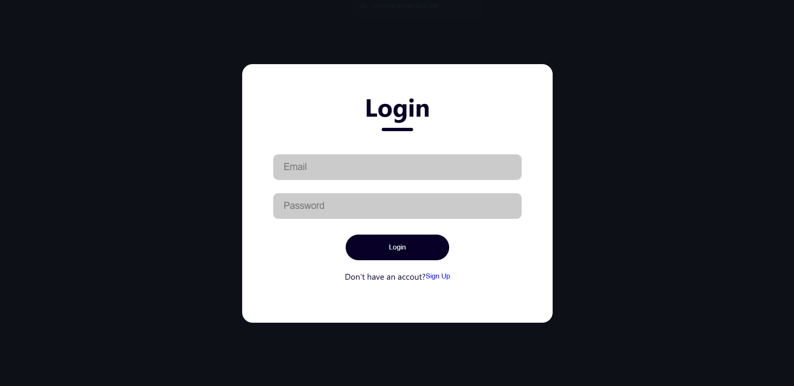
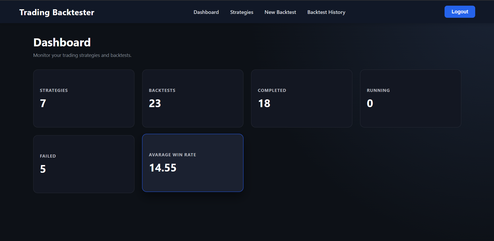
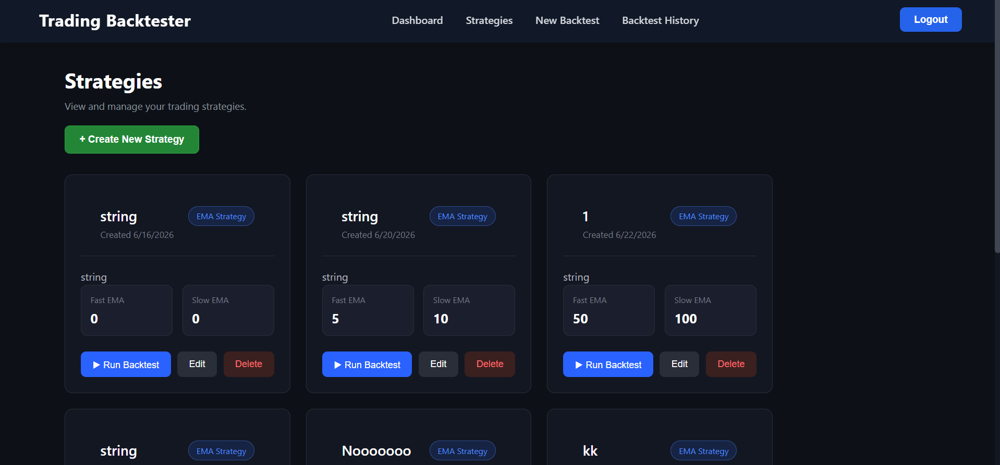
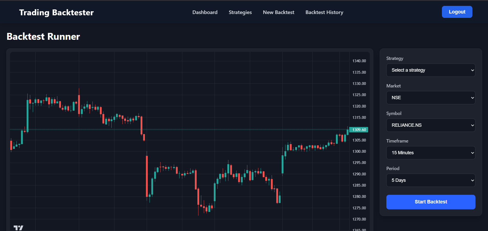
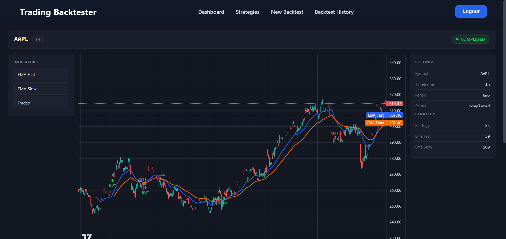
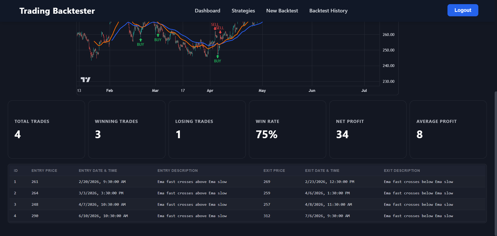

# 📈 Trading Backtesting Application

A full-stack web application for building, running, and analyzing algorithmic trading strategies against historical market data — with async backtest execution, interactive candlestick charts, and detailed performance analytics.

[](https://trading-back-testing-application.vercel.app)
[](https://trading-backtester-rz8p.onrender.com/docs)
### 🌐 [Live Demo →](https://trading-back-testing-application.vercel.app/) &nbsp;|&nbsp; 📄 [API Docs →](https://trading-backtester-rz8p.onrender.com/docs)

---

## Table of Contents

- [Overview](#overview)
- [Live Demo](#-live-demo)
- [Features](#-features)
- [Screenshots](#️-screenshots)
- [Tech Stack](#️-tech-stack)
- [Architecture](#️-architecture)
- [Strategy Logic](#-strategy-logic)
- [Getting Started](#-getting-started)
- [Folder Structure](#-folder-structure)
- [Roadmap](#-roadmap)
- [Author](#-author)

---

## Overview

Users register, define an EMA crossover strategy, and queue a backtest against historical price data. The job runs asynchronously on a Redis-backed worker, and results — trade markers, an interactive chart, and performance metrics — are ready as soon as the run completes.

---

## ✨ Features

| | |
|---|---|
| 🔐 | JWT-based authentication (register & login) |
| 📊 | Create and manage trading strategies |
| ⚡ | Run backtests asynchronously via a background job queue |
| 📈 | Interactive candlestick charts with EMA overlays |
| 🟢🔴 | Buy / sell markers plotted directly on the chart |
| 📋 | Full trade history table per backtest |
| 📉 | Performance analytics (win rate, net profit, and more) |
| 📚 | Backtest history across all runs |
| 🔄 | Background job processing with Redis Queue (RQ) |

---

## 🖼️ Screenshots

| Login | Dashboard |
|---|---|
|  |  |

| Strategy List | Backtest Setup |
|---|---|
|  |  |

| Backtest Results |
|---|
|  | 

---

## 🏗️ Tech Stack

**Frontend**
- React + Vite
- React Router
- Axios
- Lightweight Charts

**Backend**
- FastAPI
- SQLAlchemy
- JWT Authentication
- RQ (Redis Queue)
- Redis

**Database**
- MySQL

**Deployment**

| Layer | Provider |
|---|---|
| Frontend | Vercel |
| Backend | Render |
| Database | Clever Cloud (MySQL) |
| Queue | Upstash Redis |

---

## ⚙️ Architecture

```
React (Vercel)
      │
      ▼
FastAPI Backend (Render) ───────► MySQL (Clever Cloud)
      │
      ▼
Redis Queue (Upstash)
      │
      ▼
RQ Worker ───────► Backtesting Engine
```

The API handles requests and persistence directly; long-running backtests are pushed onto a Redis queue and picked up by an RQ worker so the request/response cycle stays fast regardless of backtest size.

---

## 📊 Strategy Logic

### EMA Crossover (currently implemented)

| Signal | Condition |
|---|---|
| 🟢 Buy | Fast EMA crosses **above** Slow EMA |
| 🔴 Sell | Fast EMA crosses **below** Slow EMA |

More strategies are planned — see [Roadmap](#-roadmap).

---

## 🚀 Getting Started

### Prerequisites
- Python 3.10+
- Node.js 18+
- A running Redis instance
- A MySQL database

### Clone the repository

```bash
git clone https://github.com/Pujith-y/Trading_BackTesting_Application.git
cd Trading_BackTesting_Application
```

### Backend setup

```bash
cd backend
python -m venv .venv
source .venv/bin/activate      # On Windows: .venv\Scripts\activate
pip install -r requirements.txt
```

Create a `.env` file in `backend/`:

```env
DATABASE_URL=
SECRET_KEY=
ALGORITHM=HS256
ACCESS_TOKEN_EXPIRE_MINUTES=60
REDIS_URL=
```

Run the API:

```bash
fastapi dev main.py
```

In a separate terminal, start the background worker:

```bash
rq worker
```

### Frontend setup

```bash
cd trading-backtester-ui
npm install
npm run dev
```

The app will be available at `http://localhost:5173`, with the API at `http://localhost:8000` by default.

---

## 📂 Folder Structure

```
backend/
├── routes/          # API route handlers
├── services/         # Business logic (backtesting, analytics, etc.)
├── models.py         # SQLAlchemy models
├── database.py        # DB session/engine setup
└── worker.py         # RQ worker entrypoint

trading-backtester-ui/
├── src/
│   ├── components/     # Reusable UI components (charts, tables, cards)
│   ├── pages/         # Route-level pages
│   └── api/           # API client (Axios)
```

---

## 📈 Roadmap

- [ ] Additional technical indicators (RSI, MACD, Bollinger Bands, etc.)
- [ ] Multi-asset portfolio backtesting
- [ ] Position sizing
- [ ] Risk management rules
- [ ] Stop-loss & take-profit support
- [ ] Richer performance charts (equity curve, drawdown)
- [ ] Side-by-side strategy comparison
- [ ] Live paper trading

---

## 🌐 Live Demo

- **Frontend:** [your-vercel-app.vercel.app](https://your-vercel-app.vercel.app)
- **API Docs:** [trading-backtester-rz8p.onrender.com/docs](https://trading-backtester-rz8p.onrender.com/docs)

---

## 👨‍💻 Author

**Pujith**

- GitHub: [@Pujith-y](https://github.com/Pujith-y)
- LinkedIn: https://www.linkedin.com/in/pujith-y-2a67ba2a5

---

## ⭐ Support

If this project was useful to you, consider giving it a star on GitHub — it helps others find it.